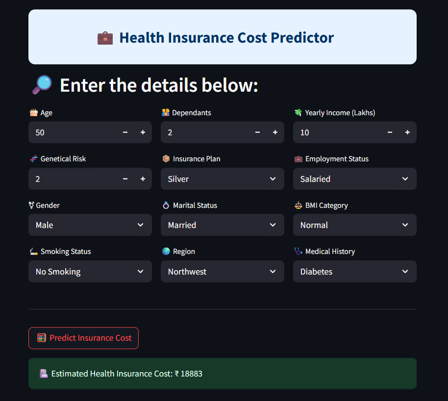

# 💰 Health Insurance Premium Predictor

An intelligent web application built with Streamlit that estimates individual health insurance premiums based on demographic, lifestyle, and medical inputs. By using separate regression models for different age segments, it delivers more tailored and accurate predictions.

---

## 🌐 Live Website
You can try the tool live here: **[Health Insurance Premium Predictor](https://vaibhav-project-premium-prediction.streamlit.app/)**

---

## 🎥 Presentation
Watch the full project presentation here: **[Health Insurance Premium Predictor Presentation](https://vaibhav-projects.my.canva.site/health-insurance-premium-prediction)**

---

## 🛠 Features  
- Interactive and clean Streamlit interface  
- Predicts premium cost based on user inputs like age, BMI, smoking status, income, etc.  
- Dual-model approach for better accuracy:
    - Linear Regression for younger users
    - XGBoost for the rest of the population
- Uses pre-trained and serialized models & scalers for real-time predictions  
- Lightweight, fast, and easy to run locally
- No database or backend server required

---

## 📂 Project Structure

```
Health_Insurance_Cost_Predictor/
│
├── artifacts/                      # Serialized models and scalers
│   ├── model_rest.joblib           # XGBoost model for the general adult population
│   ├── model_young.joblib          # Linear Regression model for younger users
│   ├── scaler_rest.joblib          # StandardScaler fitted on “rest” training data
│   └── scaler_young.joblib         # StandardScaler fitted on “young” training data
│
├── LICENSE                         # Apache License file
├── README.md                       # This documentation
├── main.py                         # Streamlit app logic
├── prediction_helper.py            # Model loading and prediction logic
└── requirements.txt                # Python dependencies
```

---

## 🚀 How to Run Locally  
### Prerequisites:  
- Python 3.8+

1. **Clone the repository**:
   ```bash
   git clone https://github.com/vaibhavgarg2004/Health-Insurance-Premium-Predictor.git
   cd Health-Insurance-Premium-Predictor
   ```
2. **Install dependencies**:   
   ```commandline
    pip install -r requirements.txt
   ```
5. **Run the Streamlit app**:   
   ```commandline
    streamlit run main.py
   ```

---

## 🧠 How It Works

1. **User Inputs**  
   - **Age** (years)  
   - **Number of Dependents**  
   - **Income in Lakhs**  
   - **Genetical Risk** (0 = none, 1 = low, 2 = moderate, 3 = high)  
   - **Insurance Plan** (e.g., Bronze, Silver, Gold)  
   - **Employment Status** (e.g., Salaried, Self-Employed, Unemployed)  
   - **Gender** (Male/Female)  
   - **Marital Status** (Married/Unmarried)  
   - **BMI Category** (Underweight, Normal, Overweight, Obese)  
   - **Smoking Status** (No Smoking / Smoker)  
   - **Region** (Northeast, Northwest, Southeast, Southwest)  
   - **Medical History** (No Disease / Has Disease)  

2. **Segmentation Logic**  
   - **Age <= 25** → Uses **`scaler_young.joblib`** and **`model_young.joblib`** (Linear Regression).
   - **Age > 25** → Uses **`scaler_rest.joblib`** and **`model_rest.joblib`** (XGBoost Regressor).

3. **Prediction Flow**  
   - Input data is preprocessed using the respective scaler.  
   - Features are passed to the appropriate model.  
   - The predicted premium cost is returned instantly.

---
   
## 🖼️ Application Snapshot



---

## 📄 License
This project is licensed under the **Apache License 2.0**. See the [LICENSE](./LICENSE) file for details.

---

*Don’t guess—predict. Discover your insurance premium with smart insights.*

